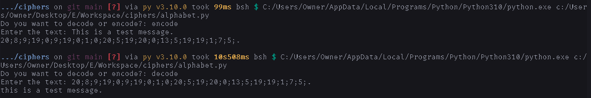
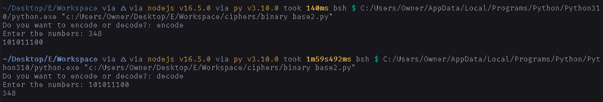

# How to use

1. Install [**python**](https://www.python.org/downloads/)
2. Download the file of the cipher that you want.
3. Open the downloads folder.
4. Double click the file that you downloaded.

### Examples

